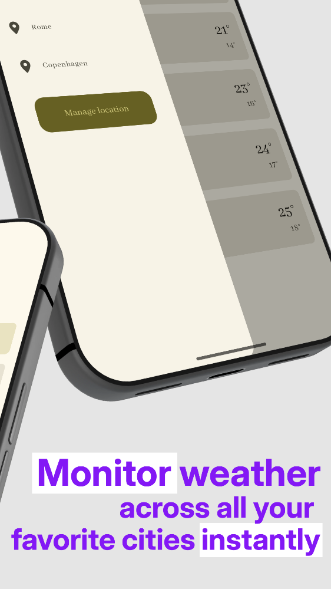
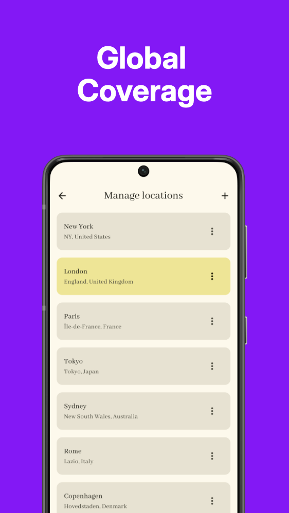

<p align="center">
 
</p>

# Weather Forecast Application

[](https://developer.android.com)
[](https://gradle.org)
[](https://kotlinlang.org)
[](https://developer.accuweather.com)

A modern, feature-rich weather application built with Jetpack Compose and Kotlin, designed to provide accurate weather forecasts with an intuitive user experience. The application leverages the AccuWeather API to deliver real-time weather data with offline caching capabilities.

<p align="center">
 



</p>

## 🌟 Features

- **Real-time Weather Data**: Access current conditions, hourly forecasts, and extended daily forecasts
- **Location-Based Services**: Search for weather by city name with geolocation support
- **Multi-location Management**: Save and manage multiple weather locations for quick access
- **Dynamic Theming**: Adaptive color schemes that respond to current weather conditions
- **Offline Support**: Local data caching using Room database for continued functionality without internet
- **Internationalization**: Multi-language support with localization for global accessibility
- **Material Design 3**: Modern UI with adaptive layouts and responsive design patterns

## 🛠️ Technology Stack

### Core Technologies
- **Kotlin**: Modern, expressive programming language for Android development
- **Jetpack Compose**: Declarative UI toolkit for building native Android interfaces
- **Coroutines**: Asynchronous programming for non-blocking operations
- **Flow**: Reactive streams for continuous data updates

### Architecture Components
- **Hilt**: Dependency injection framework for improved modularity and testability
- **Room Database**: Robust local data persistence with SQLite abstraction
- **DataStore**: Preferences storage for lightweight configuration data
- **Navigation Component** (navigation-compose): Type-safe navigation between composables

### Networking & Data Handling
- **Retrofit**: Type-safe HTTP client for RESTful web services
- **OkHttp**: Low-level HTTP client with advanced networking features
- **GSON**: JSON parsing used as Retrofit converter for API responses

### Testing Frameworks
- **JUnit 5**: Used for JVM unit tests with Robolectric support
- **MockK**: Mocking framework for Kotlin
- **Robolectric**: Unit testing on the JVM
- **Espresso**: UI testing framework
- **Hilt Testing**: Dependency injection for test environments

## 🏗️ Architecture Overview

The application implements a clean architecture pattern with MVVM (Model-View-ViewModel) principles:

```
┌─────────────────┐    ┌─────────────────┐    ┌─────────────────┐
│   Presentation  │    │   Domain        │    │   Data          │
│                 │    │                 │    │                 │
│   Composables   │◄──►│   Use Cases     │◄──►│   Repositories  │
│   ViewModels    │    │   (Interactors) │    │   Data Sources  │
│                 │    │                 │    │                 │
└─────────────────┘    └─────────────────┘    └─────────────────┘
         ▲                       ▲                       ▲
         │                       │                       │
         └───────────────────────┴───────────────────────┘
                           Clean Architecture
```

### Key Architectural Principles

- **Separation of Concerns**: Each layer has distinct responsibilities
- **Dependency Inversion**: High-level modules don't depend on low-level modules
- **Testability**: Clean boundaries enable comprehensive unit and integration testing
- **Maintainability**: Modular design supports long-term evolution
- **Scalability**: Architecture supports feature growth without complexity increase

### SOLID Principles Implementation

- **Single Responsibility Principle**: Each class has a single, well-defined purpose
- **Open/Closed Principle**: Extensible design through abstractions and composition
- **Liskov Substitution Principle**: Proper inheritance hierarchies ensuring substitutability
- **Interface Segregation Principle**: Focused interfaces preventing unnecessary dependencies
- **Dependency Inversion Principle**: Abstractions over concrete implementations

## 🧠 Key Technical Decisions

- **Jetpack Compose** over XML for faster UI iteration and state-driven UI
- **Offline-first approach** using Room to improve resilience and UX
- **Mock build variant** to decouple UI development from API availability
- **Clean Architecture** to ensure testability and long-term maintainability

### Non-Goals
- Not intended as a production-published app
- Focused on architecture and code quality rather than monetization

## 📋 Project Structure

```
 app/                    
 ├── src/
 │   ├── main/             # Main source code
 │   │   ├── java/com/conrad/weather/
 │   │   │   ├── di/       # Dependency injection modules
 │   │   │   ├── local/    # Local data sources (Room database, settings)
 │   │   │   │   ├── cities/
 │   │   │   │   └── settings/
 │   │   │   ├── model/    # Data models (Area, City, WeatherForecast, etc.)
 │   │   │   │   └── stubs/
 │   │   │   ├── network/  # Network layer (retrofit, repositories)
 │   │   │   │   ├── other/
 │   │   │   │   ├── repository/
 │   │   │   │   └── retrofit/
 │   │   │   ├── repository/ # Repository implementations
 │   │   │   ├── ui/         # UI layer (Jetpack Compose screens)
 │   │   │   │   ├── common/
 │   │   │   │   ├── detail/
 │   │   │   │   ├── drawer/
 │   │   │   │   ├── home/
 │   │   │   │   ├── manage/
 │   │   │   │   ├── navigation/
 │   │   │   │   ├── search/
 │   │   │   │   └── theme/
 │   │   │   └── utils/    # Utility classes and extensions
 │   │   └── res/          # Resources (drawables, layouts, values)
 │   ├── mock/             # Mock build variant (for offline development)
 │   ├── prod/             # Production build variant
 │   ├── sharedTest/       # Shared test utilities
 │   ├── test/             # Unit tests (JVM)
 │   └── androidTest/      # Instrumented tests
 ├── build.gradle.kts      # Module build configuration
 └── proguard-rules.pro    # Code obfuscation rules
```

## 🚀 Build Variants

Build variants are implemented using Gradle product flavors with separate source sets. The application supports two build variants with different environments:

- **Mock Variant (`mock`)**: Uses mock data services for development and testing
  - Package name: `com.conrad.weather.mock`
  - Suffix: `-mock`
  - Ideal for UI development without external API dependencies
  - Data is loaded from local mock sources instead of external APIs
  - Perfect for offline development and testing various scenarios

- **Production Variant (`prod`)**: Connects to live weather services
  - Package name: `com.conrad.weather.prod`
  - Suffix: `-prod`
  - Full production functionality with real data
  - Connects to external weather APIs for live data
  - Includes all production features and analytics

## 🔧 Setup Instructions

### 1. Clone the Repository

```bash
git clone https://github.com/groschang/weather_android.git
cd weather_android
```

### 2. API Configuration

This application uses the AccuWeather API to fetch weather data. You'll need to obtain an API key from AccuWeather to run the application.

#### About AccuWeather API

- **Services Provided**: Current conditions, forecasts, location lookup, MinuteCast® (minute-by-minute precipitation forecasts), RealFeel® temperature, lifestyle indices, severe weather alerts, and more.
- **Data Parameters**: Access to 250+ weather data parameters including detailed forecasts, precipitation probabilities, tropical cyclone information, and weather imagery maps.
- **Coverage**: Global coverage with over 3.5 million locations worldwide.

#### API Key Setup

1. **Sign up for an API key**:
   - Visit the [AccuWeather Developer Portal](https://developer.accuweather.com/)
   - Click "Create account" and complete the registration process
   - Once registered, you'll receive your API key

2. **Free Tier Information**:
   - AccuWeather offers a 14-day free trial to explore all features
   - For current free tier limits, check the developer portal as offerings may change
   - The API uses location keys rather than coordinates for most requests, which you can obtain through the Location API first

3. **Configure your local.properties file**:
   - Copy the `local.properties.template` file to `local.properties` in the root project directory
   - Replace `"secret"` with your actual API key from AccuWeather
   - The default base URL is already set to `https://dataservice.accuweather.com`

Example of `local.properties`:
```
sdk.dir=/Users/YourName/Library/Android/sdk
API_KEY="your_actual_api_key_here"
BASE_URL="https://dataservice.accuweather.com"
```

**Important**: The `local.properties` file is included in `.gitignore` and should never be committed to version control as it contains sensitive API credentials.

### 3. Build and Run

#### Using Android Studio:
1. Open the project in Android Studio
2. Select your preferred build variant (mock or prod)
3. Choose your target device/emulator
4. Click the "Run" button

#### Using Command Line:
```bash
# Build the project
./gradlew build

# Install debug APK
./gradlew installDebug

# Or build specific variant
./gradlew assembleProdDebug
./gradlew assembleMockDebug
```

## 🧪 Testing Strategy

The application follows a comprehensive testing approach:

### Unit Tests
- Located in `src/test/` (JVM tests with Robolectric support)
- Test business logic in isolation using MockK for mocking dependencies
- Achieve high code coverage for critical paths
- Include shared test utilities in `src/sharedTest/` for common test scenarios

### Integration Tests
- Located in `src/androidTest/` (instrumented tests on device/emulator)
- Test UI interactions and user flows using Espresso
- Validate data flow between layers and ensure proper dependency injection
- Verify end-to-end functionality in real Android environment

### Build-Specific Testing
- **Mock variant**: Enables development without external API dependencies using mock data services
- **Production variant**: Tests full functionality with live weather APIs
- Both variants facilitate faster iteration cycles and allow testing of edge cases

### Running Tests
```bash
# Run all unit tests
./gradlew test

# Run unit tests for specific variant
./gradlew testProdDebug
./gradlew testMockDebug
```

## 🚢 Deployment

### Build Variants
- **Debug**: Development builds with debugging enabled
- **Release**: Optimized builds for distribution

### Build Commands
```bash
# Build debug APK for all variants
./gradlew assembleDebug

# Build release APK for all variants
./gradlew assembleRelease

# Build specific variant
./gradlew assembleProdDebug
./gradlew assembleProdRelease
./gradlew assembleMockDebug
./gradlew assembleMockRelease

# Install debug build on connected device
./gradlew installProdDebug
./gradlew installMockDebug
```

## 🤝 Contributing

We welcome contributions to enhance the application! Here's how you can contribute:

1. Fork the repository
2. Create a feature branch (`git checkout -b feature/amazing-feature`)
3. Make your changes
4. Add tests for new functionality
5. Ensure all tests pass (`./gradlew test connectedAndroidTest`)
6. Commit your changes (`git commit -m 'Add amazing feature'`)
7. Push to the branch (`git push origin feature/amazing-feature`)
8. Open a Pull Request

### Code Standards
- Follow [Kotlin Coding](https://kotlinlang.org/docs/coding-conventions.html) 
- Maintain consistent architecture patterns
- Write comprehensive unit tests
- Document public APIs
- Include meaningful commit messages

## 🎯 Project Goals

This project was created to:
- Demonstrate modern Android development with Jetpack Compose
- Apply Clean Architecture in a real-world scenario
- Showcase offline-first design and multi-variant builds
- Practice scalable, testable, and maintainable app architecture